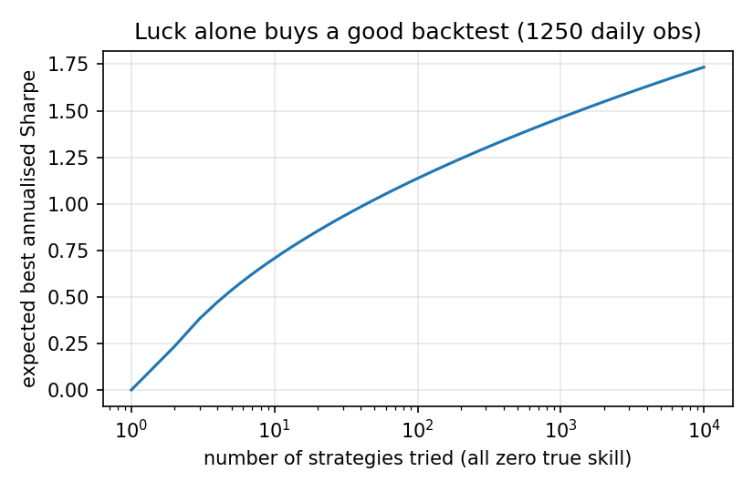
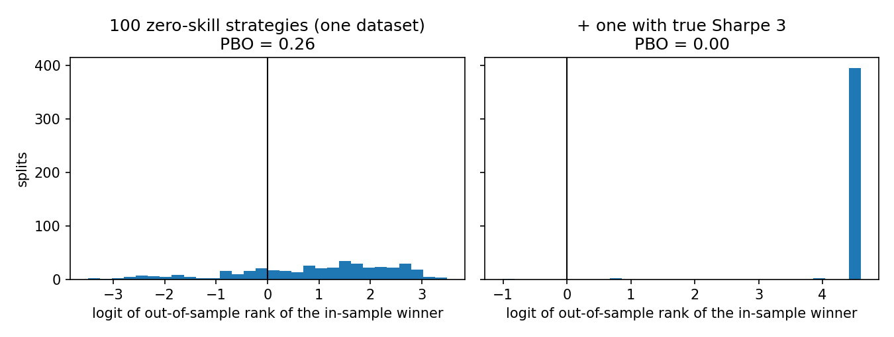
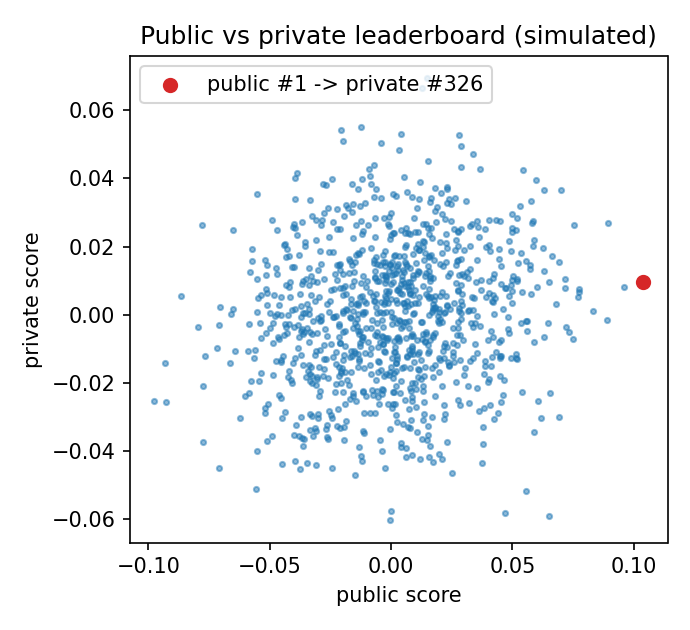

# backtest-overfitting-lab


A small Python project about one question: if you try many strategies and keep the best one, how much of its result is luck?

## Why I built this

In my machine learning course I took part in a Kaggle competition. My score on the public leaderboard was 0.653 and on the private one 0.630. I still finished first, but the drop bothered me: I had picked my model on a noisy score, so of course it looked better than it was. Finance has the same problem with backtests, and quantitative researchers have names and formulas for it. I wanted to build those formulas myself to see them work.

## What is in it

`src/overfit/` has three pieces. `sharpe.py` computes the Sharpe ratio, its standard error with the skewness and kurtosis correction, and the Deflated Sharpe Ratio of Bailey and López de Prado (2014). `pbo.py` computes the probability of backtest overfitting with combinatorially symmetric cross-validation (Bailey, Borwein, López de Prado and Zhu, 2017). `simulate.py` generates fake strategy returns and a fake Kaggle-style leaderboard. Everything runs on simulated data.

## What I found

All numbers come from `experiments/run_experiments.py`, and the raw values are in `results.json`. I used 1250 daily returns, about five years.

**Luck is enough to get a good backtest.** I generated strategies with zero true skill and kept the best. With 10 strategies, a standard significance test approves the best one 36% of the time. With 100, it approves it every time (300 runs out of 300), and the best one has an annualised Sharpe of about 1.15 on average. The deflated test, which accounts for the number of strategies tried, never approved it. With a single strategy both tests approve about 5% of the time, as they should.



**The probability of backtest overfitting.** On pure noise it averages about 0.48 over 30 datasets, so the in-sample winner is a coin flip out of sample. With one strategy of true Sharpe 3 hidden among 100, it drops to 0.01. With true Sharpe 1 it only drops to 0.41: at this sample size a real but modest edge is hard to tell from luck. The value for a single dataset is also very noisy (standard deviation about 0.15), so I would not trust one number from one backtest.



**Public versus private leaderboard.** With 1000 simulated teams, when the differences in true skill are small compared to the noise, the public winner ends around rank 296 on the private board. When skill differences are large, the median rank is 2 and the winner stays first about half the time. The parameters are made up, not fitted to any real competition.



## Run it

```bash
pip install -e ".[dev]"
pytest
python experiments/run_experiments.py
```

## What this does not show

The returns are independent and Gaussian, which real returns are not. The deflated Sharpe ratio assumes the strategies tried are independent, so with correlated strategies its correction is too strong. The two halves of each split in the PBO method use the same data, which biases the result when there are very few strategies. And I have not tried any of this on real market data yet.

## References

- Bailey, D. H. and López de Prado, M. (2014). The Deflated Sharpe Ratio: Correcting for Selection Bias, Backtest Overfitting and Non-Normality. *Journal of Portfolio Management* 40(5).
- Bailey, D. H., Borwein, J., López de Prado, M. and Zhu, Q. J. (2017). The Probability of Backtest Overfitting. *Journal of Computational Finance* 20(4).
- Mertens, E. (2002). Comments on variance of the IID estimator in Lo (2002).
